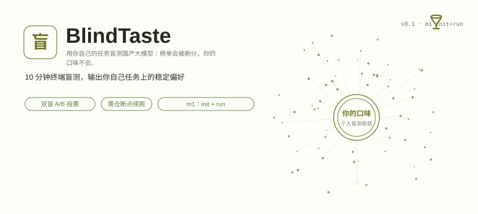
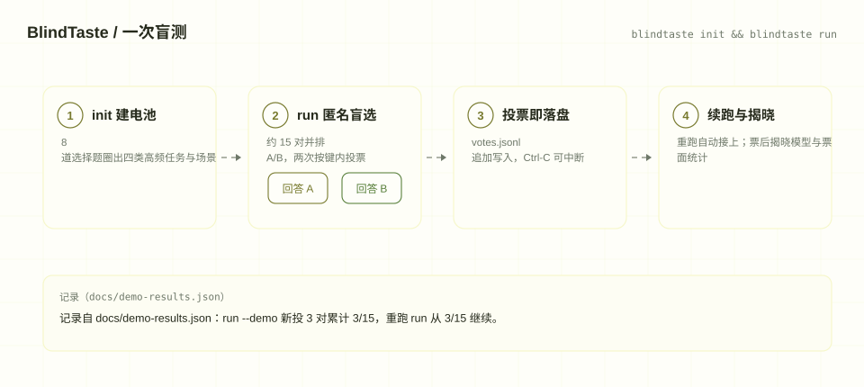
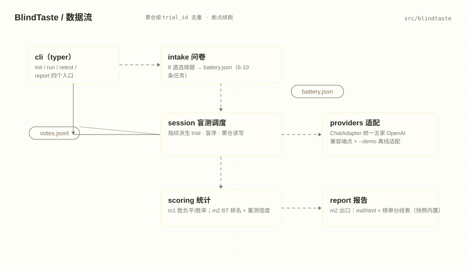
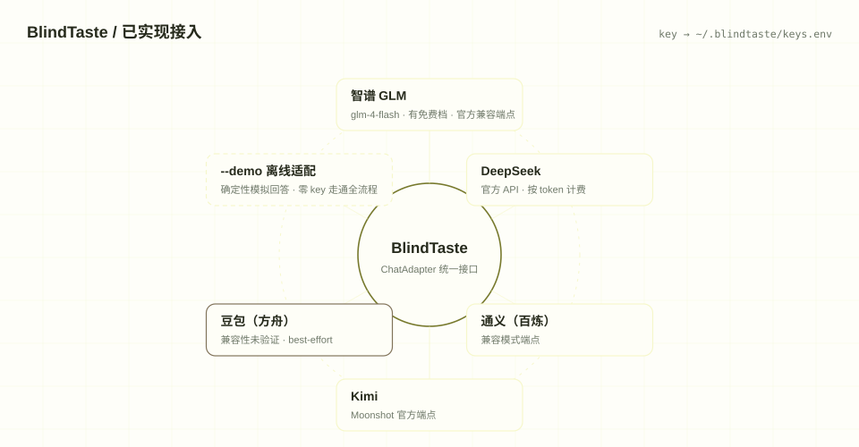

[English](./README.en.md) | **简体中文**

<div align="center">

# BlindTaste 盲测宝

<picture>
  <source media="(prefers-color-scheme: dark)" srcset="https://readme-typing-svg.demolab.com/?font=Noto+Sans+SC&weight=600&size=24&pause=1400&color=E1E656&center=true&vCenter=true&random=false&width=640&lines=%E6%A6%9C%E5%8D%95%E4%BC%9A%E8%A2%AB%E5%88%B7%E5%88%86%EF%BC%8C%E4%BD%A0%E7%9A%84%E5%8F%A3%E5%91%B3%E4%B8%8D%E4%BC%9A%E3%80%82;%E6%8A%8A%E9%AB%98%E9%A2%91%E4%BB%BB%E5%8A%A1%E6%89%93%E5%8C%85%E6%88%90+10+%E5%88%86%E9%92%9F%E7%9B%B2%E6%B5%8B;%E5%8F%8C%E7%9B%B2+A%2FB+%E6%8A%95%E7%A5%A8+%C2%B7+%E7%A5%A8%E4%BB%93%E6%96%AD%E7%82%B9%E7%BB%AD%E8%B7%91">
  
</picture>

**用你自己的任务盲测国产大模型：改简历、写周报、PPT 大纲、翻译，逐对匿名 A/B 投票，先看清你自己任务上的稳定偏好，再决定用哪个模型。**

<p>
  
  
  
  
</p>

<picture>
  <source media="(max-width: 640px) and (prefers-color-scheme: dark)" srcset="assets/presentation/hero-mobile-dark.svg">
  <source media="(max-width: 640px)" srcset="assets/presentation/hero-mobile-light.svg">
  <source media="(prefers-reduced-motion: reduce) and (prefers-color-scheme: dark)" srcset="assets/presentation/hero-static-dark.svg">
  <source media="(prefers-reduced-motion: reduce)" srcset="assets/presentation/hero-static-light.svg">
  <source media="(prefers-color-scheme: dark)" srcset="assets/presentation/hero-dark.svg">
  
</picture>

</div>

## 为什么需要它

国产旗舰全部免费、每月轮换，「哪个改我的周报更好」每个季度都要重新回答一次。现有的三条路都不可靠：

- **聚合榜单**：Artificial Analysis 的 Intelligence Index 这类指标会被 farm——v4.3 更新换上的私有评测上线数天内就出现刷分指控，而它本来也回答不了「哪个改*你的*简历更好」。
- **LLM 裁判**：裁判互相附和不等于正确（这是公开的方法学质疑，不是阴谋论），而且谁给裁判付钱本身就是问题。
- **双开肉眼对比**：同一个 prompt 开两个 App 肉眼看，是单次抽样——展示顺序、心情、上一轮印象都足以翻转你的结论。

BlindTaste 把 Chatbot Arena 验证过的**匿名双模型盲选**机制搬进你的终端，只改一件事：票不进群体 Elo，只进你自己的票仓。8 道中文选择题圈出你的高频任务，生成任务电池；盲测每对只见匿名 A/B，投票后才揭晓模型；m2 起加入随机重测（盲序翻转），用**重测一致率**给你的偏好打一个信度分——它很可能与 Intelligence Index 不一致，而这正是它有用的地方。

## 10 分钟跑通

需要 Python 3.12+（[uv](https://docs.astral.sh/uv/) 或 pip 均可）：

```bash
git clone https://github.com/SuperMarioYL/blindtaste.git
cd blindtaste
uv tool install .        # 或 pip install -e .
```

**第一步：建电池（约 60 秒）**

```bash
blindtaste init
```

8 道中文选择题：勾选四类高频任务（改简历 / 写周报 / PPT 大纲 / 翻译）、各选场景、每类 1-2 条、可选加 0-2 条自定义任务，最后选 3 家参测模型。产出 6-10 条任务的任务电池。

**第二步：配 key（约 60 秒）**

把 1-2 个 API key 粘贴到 `~/.blindtaste/keys.env`：

```bash
ZHIPU_API_KEY=sk-xxx
DEEPSEEK_API_KEY=sk-yyy
```

智谱 `glm-4-flash-250414` 有免费档，先只用它也能跑通；各家详细端点见[模型接入](#模型接入)。

**第三步：盲测（约 10 分钟）**

```bash
blindtaste run
```

每对先显示任务与两份并排的匿名回答，输入 `a` / `b` / `tie` 投票，投票后立即揭晓 A/B 背后的模型。约 15 对，Ctrl-C 随时中断，重跑自动从上次进度继续。不配 key 想先体验交互：`blindtaste run --demo --limit 2`。

> v0.1（m1）到此为止：`blindtaste retest`（随机重测 + 盲序翻转 + 重测一致率信度分）与 `blindtaste report`（带信度评分的个人选型报告 md/html）在 m2 交付；当前 `report` 命令展示电池、首轮进度与票面统计。

## 录屏演示

真实终端录制（[docs/demo-results.json](docs/demo-results.json) 里有可重放的命令与输出）：`init` 问卷建电池 → `run --demo` 匿名盲选 → 断点续跑 → `report` 查看进度。演示使用 `--demo` 离线模拟回答，不调用任何 API、不需要 key；盲测交互、票仓与续跑都是真实代码路径。


想要自己的版本：按 [docs/demo-results.json](docs/demo-results.json) 里的命令重放即可；[docs/demo.tape](docs/demo.tape) 是等价的 vhs 录制脚本。

## 它如何工作

<picture>
  <source media="(max-width: 640px) and (prefers-color-scheme: dark)" srcset="assets/presentation/process-mobile-dark.svg">
  <source media="(max-width: 640px)" srcset="assets/presentation/process-mobile-light.svg">
  <source media="(prefers-reduced-motion: reduce) and (prefers-color-scheme: dark)" srcset="assets/presentation/process-static-dark.svg">
  <source media="(prefers-reduced-motion: reduce)" srcset="assets/presentation/process-static-light.svg">
  <source media="(prefers-color-scheme: dark)" srcset="assets/presentation/process-dark.svg">
  
</picture>

三条不变量贯穿全程：

1. **票面只见匿名 A/B**。展示侧与真实模型的映射由盲序（`blind_order`）决定，投票后才揭晓——偏好先于品牌形成。
2. **票仓追加式落盘**。每张票立即写入 `votes.jsonl`（自描述：任务、模型映射、盲序、选择、思考时长），按 `trial_id` 去重，Ctrl-C 之后重跑从断点继续。
3. **trial 由电池内容指纹确定性生成**。同一份任务与模型永远得到同一批对局，重装、重跑、换机器结果一致；回答缓存按（模式, 模型, 任务）复用，同一任务不会重复烧 API。

## 架构

单进程 Python CLI，无服务器、无数据库，状态全部在本地目录（默认 `~/.blindtaste/`）：

<picture>
  <source media="(max-width: 640px) and (prefers-color-scheme: dark)" srcset="assets/presentation/architecture-mobile-dark.svg">
  <source media="(max-width: 640px)" srcset="assets/presentation/architecture-mobile-light.svg">
  <source media="(prefers-reduced-motion: reduce) and (prefers-color-scheme: dark)" srcset="assets/presentation/architecture-static-dark.svg">
  <source media="(prefers-reduced-motion: reduce)" srcset="assets/presentation/architecture-static-light.svg">
  <source media="(prefers-color-scheme: dark)" srcset="assets/presentation/architecture-dark.svg">
  
</picture>

| 模块 | 职责 |
| --- | --- |
| `cli.py` | typer 入口：init / run / retest / report |
| `intake.py` | 问卷 → 任务电池；`--tasks` 种子文件直建；电池指纹 |
| `providers.py` | 模型注册表 + OpenAI 兼容适配，统一在 `ChatAdapter` 接口后；`--demo` 离线适配器 |
| `session.py` | 盲测调度：指纹派生 trial、盲序、票仓读写、回答缓存 |
| `scoring.py` | 票面统计（胜负平 / 每类任务胜率）；m2：BT 排名、重测一致率、噪声任务 |
| `report.py` | m2 报告出口；聚合榜单快照装载（`data/aggregate_index_snapshot.json`） |

任务内容（问卷问题与四类模板）在 [`src/blindtaste/templates/zh_tasks.toml`](src/blindtaste/templates/zh_tasks.toml)，改文案不需要动代码。

## 使用

```bash
blindtaste init                                        # 问卷建电池
blindtaste init --tasks examples/tasks.example.toml   # 种子模式：跳过问卷，只选模型
blindtaste run                                         # 盲测（约 15 对，可中断续跑）
blindtaste run --demo --limit 2                        # 离线演示：模拟回答、不调 API、限投 2 对
blindtaste run --models glm-4-flash-250414,kimi-k3     # 本次覆盖参测模型
blindtaste retest                                      # （m2）随机重测、盲序翻转、信度分
blindtaste report                                      # （m2 占位）当前展示进度与票面统计
```

| 状态文件 | 内容 |
| --- | --- |
| `~/.blindtaste/battery.json` | 任务电池：任务、模型、retest_fraction |
| `~/.blindtaste/votes.jsonl` | 追加式票仓，m2 报告的全部输入 |
| `~/.blindtaste/keys.env` | API key（`KEY=VALUE` 每行一条，`#` 注释） |
| `~/.blindtaste/cache/answers/` | 回答缓存（live 与 demo 分开键） |

状态目录可用 `--home` 或环境变量 `BLINDTASTE_HOME` 覆盖——想跑互不干扰的多套电池时有用。

## 模型接入

<picture>
  <source media="(max-width: 640px) and (prefers-color-scheme: dark)" srcset="assets/presentation/integrations-mobile-dark.svg">
  <source media="(max-width: 640px)" srcset="assets/presentation/integrations-mobile-light.svg">
  <source media="(prefers-reduced-motion: reduce) and (prefers-color-scheme: dark)" srcset="assets/presentation/integrations-static-dark.svg">
  <source media="(prefers-reduced-motion: reduce)" srcset="assets/presentation/integrations-static-light.svg">
  <source media="(prefers-color-scheme: dark)" srcset="assets/presentation/integrations-dark.svg">
  
</picture>

只走各家**官方 OpenAI 兼容端点**，不做浏览器自动化或抓包：

| 模型 | 提供方 | 端点 | key 变量 | 备注 |
| --- | --- | --- | --- | --- |
| `glm-4-flash-250414` | 智谱 | `https://open.bigmodel.cn/api/paas/v4` | `ZHIPU_API_KEY` | 有免费档 |
| `deepseek-flash` | DeepSeek | `https://api.deepseek.com` | `DEEPSEEK_API_KEY` | 按 token 计费，无免费额度 |
| `qwen3.7-plus` | 阿里云百炼（通义） | `https://dashscope.aliyuncs.com/compatible-mode/v1` | `DASHSCOPE_API_KEY` | 兼容模式 |
| `kimi-k3` | Kimi | `https://api.moonshot.cn/v1` | `MOONSHOT_API_KEY` | |
| `doubao-pro-32k` | 火山方舟（豆包） | `https://ark.cn-beijing.volces.com/api/v3` | `ARK_API_KEY` | **兼容性未验证**，best-effort |

未配置 key 时 `run` 会明确列出缺的变量与 `keys.env` 的写法再退出；豆包（方舟）的 OpenAI 兼容性从未用真实 key 验证过，所以单独标记为未验证——配置了也只作为 best-effort 参与，失败不影响其余模型的盲测。

## 能力与边界

| 能力 | v0.1（本版） | m2（规划） |
| --- | :---: | :---: |
| 问卷生成任务电池（4 类 + 自定义） | ✓ | |
| 匿名 A/B 盲选 + 投票后揭晓 | ✓ | |
| 票仓 JSONL 断点续跑 | ✓ | |
| 离线演示模式（`--demo`） | ✓ | |
| 重测（随机抽样 + 盲序翻转） | — | ✓ |
| 重测一致率信度分 / 噪声任务警示 | — | ✓ |
| Bradley-Terry 个人排名 | — | ✓ |
| 报告导出 md / html + 榜单分歧表 | — | ✓ |

明确的边界：

- `--demo` 的回答是确定性生成的模拟内容，不代表任何真实模型的表现。
- 聚合榜单快照（`src/blindtaste/data/aggregate_index_snapshot.json`）分数字段当前为 null（未抄录）：分歧表在 m2 交付，且只在你从公开榜单页人工抄录当期数值后才有意义——BlindTaste 不抓取任何榜单数据。
- 盲测需要各家官方 API key；本仓库不提供、不代理任何 key。

## 付费与商业化

工具靠卖报告与团队服务变现，**永远不靠给模型排名收费**——排名商业化恰恰是聚合榜单信任崩塌的老路。

| 阶段 | 形态 | 价格 |
| --- | --- | --- |
| **v0.1（现在）** | CLI 个人版（本仓库，MIT 开源） | 免费 |
| **v0.1（现在）** | 团队盲测试点包：10-30 人团队，用你们的真实任务建电池、5 模型盲测，交付团队汇总选型报告与决策备忘录，我们代跑（key 我们出；产品内无任何支付流程，收款码结算） | **¥1,980 / 试点** |
| v0.2+（规划） | 免 API key 的托管网页版，按次出报告 | ¥9.9 / 份 |
| v0.2+（规划） | 团队版：共享电池 + 团队汇总选型报告 | ¥39 / 人 / 月 |

试点包说明：v0.1 的 CLI 已覆盖建电池与盲测采集，试点包里的汇总报告当前由我们人工完成，m2 的自动报告落地后全流程工具化。CLI 个人版持续开源，两件事不冲突。

## 路线图

- [x] **m1 盲测电池**（本版）：init 问卷 + run 匿名盲选 + 票仓断点续跑 + 离线演示
- [ ] **m2 重测与信度**：`retest` 随机重测（盲序翻转）、重测一致率信度分、噪声任务警示、`report` 导出 md/html、与聚合榜单的分歧表
- [ ] **m3 发布套件**：种子报告《30 个真实职场任务盲测：个人排名与 Intelligence Index 的三处分歧》、Gitee 镜像、PyPI 发布（`uvx blindtaste` 一键运行）

## 常见问题

**为什么不让 LLM 当裁判自动打分？** 盲测必须由用户本人投票，这是与可被刷分榜单的本质区别：裁判互相附和不等于正确，而你的票没法被 farm。v0.1 明确排除了自动裁判。

**15 对样本，排名可信吗？** 每类任务给的是胜率而不是单一总分；m2 起一致率 < 60% 的任务会被直接标为噪声任务——报告自己声明哪里不可信，这正是与聚合榜单的区别。

**不就是 Chatbot Arena 单机版？** Arena 把你的 prompt 喂进群体 Elo；这里的票只进你自己的报告，还带断点续跑和（m2 的）重测信度分。同一个机制，回答的是不同的问题。

## 开发

```bash
uv venv && uv pip install -e ".[test]"
pytest                      # 26 项测试，模型调用全部替身，无网络、无 key
```

演示资产（SVG 图组与终端 GIF）由 [docs/render_presentation.py](docs/render_presentation.py) 与 [docs/demo.tape](docs/demo.tape) 生成，调色板来自渲染器（`web/palette.json`）。

---

<p align="center"><sub><a href="./LICENSE">MIT</a> © 2026 SuperMarioYL</sub></p>
